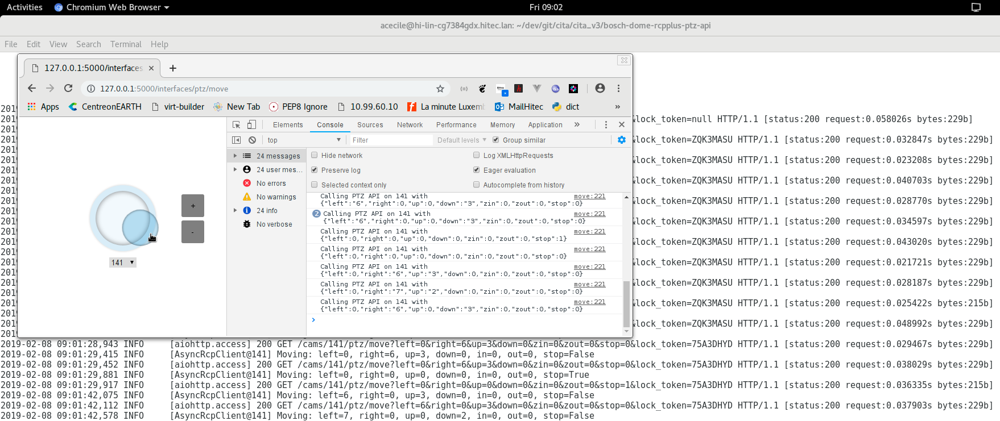
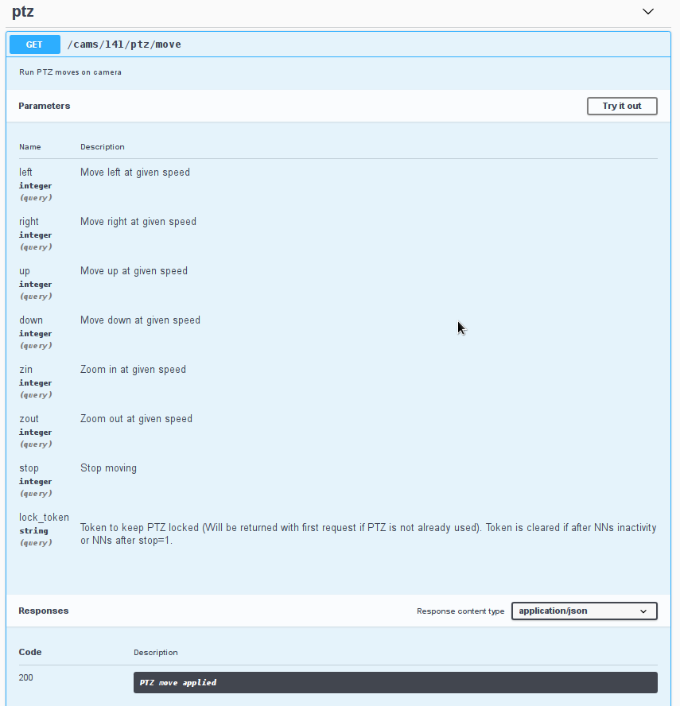

# Bosch Dome PTZ API using RCP+ protocol

# Features

  * Aiohttp (asyncio) based for maximum performance
  * Support Python 3.4+
  * SwaggerUI embedded
  * GET based routes for easier integration
  * Locking system using a token avoid concurrent moves
  * Camera definitions in INI file
  * Embedded HTML interface with JS joystick to test it

# Screenshots

## JS Interface

## SwaggerUI

